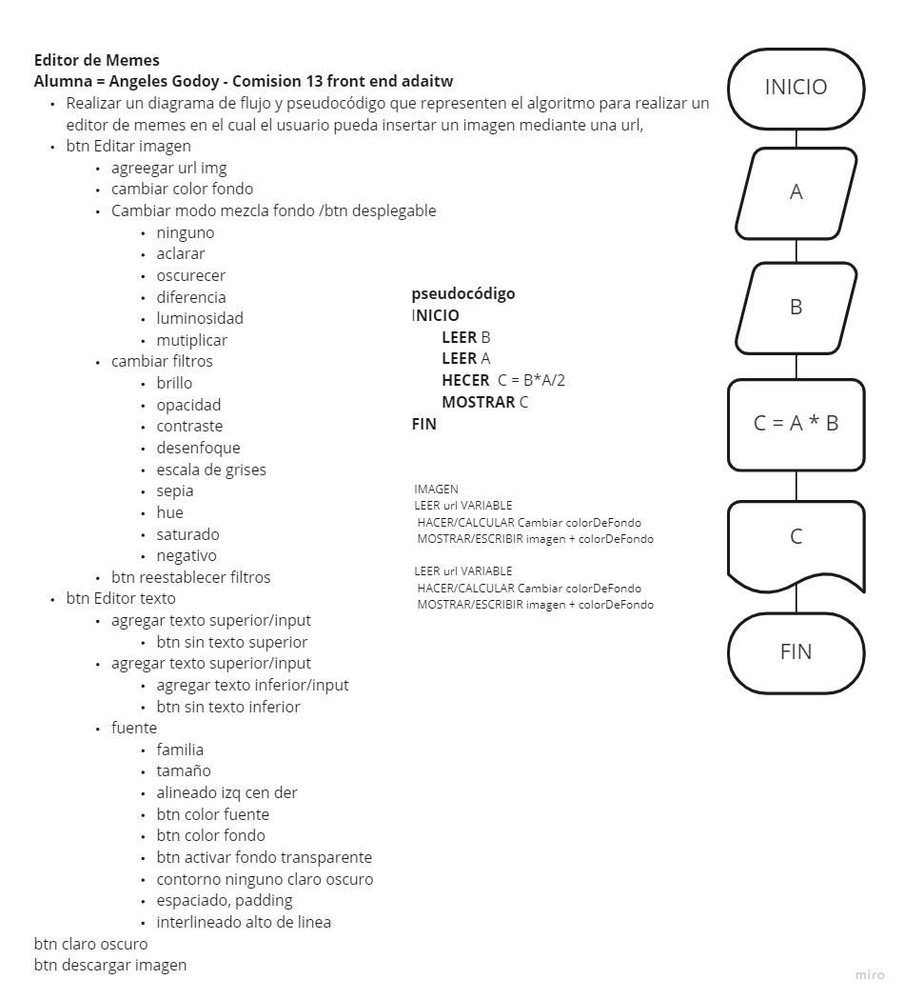

# PROYECTO-FINAL-MODULO-2

## Editor de Memes
> Este es mi segundo proyecto realizado con **HTML, CSS y JS** desde _cero_
> Se trata de un programa en el que el usuario podrá editar y descargar **memes**. 
> Podrás ver mi proceso de aprendizaje en la carrera de Desarrollo Frontend de **ADA itw**

### 👩‍💻 Pseudocódigo que representa el algoritmo para realizar un editor de memes en el cual el usuario pueda insertar un imagen mediante una url.

- btn Editar imagen
    - agreegar url img
    - cambiar color fondo
    - Cambiar modo mezcla fondo select, opciones:
        - ninguno
        - aclarar
        - oscurecer
        - diferencia
        - luminosidad
        - mutiplicar
    - cambiar filtros select
        - brillo
        - opacidad
        - contraste
        - desenfoque
        - escala de grises
        - sepia
        - hue 
        - saturado
        - negativo
    - btn reestablecer filtros
- btn Editor texto
    - agregar texto superior/input
    - btn sin texto superior
        - agregar texto superior/input
        - btn sin texto superior
        - agregar texto inferior/input
        - btn sin texto inferior
    - fuente select, opctions
        - familia select
        - tamaño select
        - btn alineado izq cen der
    - btn color fuente
    - btn color fondo
    - btn activar fondo transparente
    - contorno ninguno claro oscuro
    - espaciado, padding
    - interlineado alto de linea
- btn claro oscuro
- btn descargar imagen

### 👩‍💻 Diagrama de Flujo

Te dejo el link para que visites mi sitio [Proyecto Final Modulo 2](https://anyigp.github.io/GENERADOR-DE-MEMES/)

